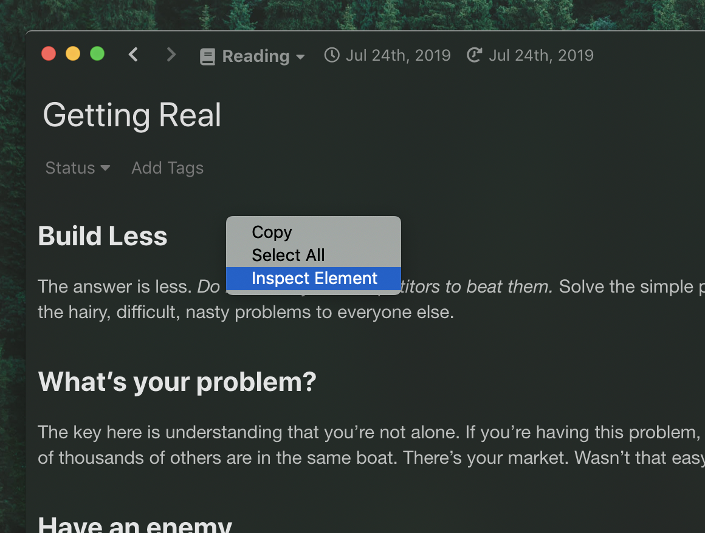

<div class="ui message">
This hacking tip requires some web development skill.
</div>

GitHub Flavored Markdown(GFM) supports some emphasises like so:

```markdown
Emphasis, aka italics, with _asterisks_ or _underscores_.

Strong emphasis, aka bold, with **asterisks** or **underscores**.

Combined emphasis with **asterisks and _underscores_**.

Strikethrough uses two tildes. ~~Scratch this.~~
```

That's usually sufficient for taking notes but sometimes not, for example, when it comes to annotating text.
It is no surprise that you think of extending GFM syntax to support additional emphasises.
However, it breaks the compatibility so you basically cannot use it on other places.

In Inkdrop, you make notebooks for each purpose.
Inkdrop lets you change styles of those emphasises that only apply to a particular notebook so you can keep your notes fully compatible with GFM.
For example, if you want to quote and highlight texts from books you read, you make a notebook named something like "Reading".
And you can define stylesheets only applied to notes in this notebook.

## Enable Development Mode

Let Inkdrop run in **Development Mode** by selecting the _Inkdrop > Preferences_ menu, clicking the _General_ tab on the left hand navigation, and check the "_Development Mode_", then reload the app by pressing <kbd>Alt+Cmd+Ctrl+R</kbd> / <kbd>Alt+Ctrl+R</kbd>

## Check the class name of the editor

First, open a note in a notebook which you would like to add custom highlightings ("Reading" in this example).
Then, right-click on the preview pane and select _"Inspect Element"_.



Developer Tools shows up. Find a _div_ element with _"editor"_ class as following:


In this example, you can see the _div_ element has _"editor editor-viewmode-preview note-WjNSf53W1 book-TjNHyND4Q"_ class, where `book-TjNHyND4Q` is the class name for "Reading" notebook.

You get it? With this class name, you can add notebook-specific stylesheets!

## Add special emphasise stylesheets for a notebook

Create a `styles.less` in [your data directory](/manual/basic-usage#user-data-directory) and write some CSS like the following:

```less
.editor.book-TjNHyND4Q {
  .mde-preview,
  .CodeMirror {
    p {
      line-height: 160%;
    }

    strong,
    .cm-strong {
      font-size: x-large;
      text-decoration: underline;
      text-underline-position: under;
      background-color: rgba(255, 255, 0, 0.1);
      text-decoration-color: rgba(200, 160, 0, 0.5);
    }
    em,
    .cm-em {
      font-weight: bold;
      font-size: large;
      text-decoration: underline;
      text-underline-position: under;
      background-color: rgba(255, 255, 0, 0.1);
      text-decoration-color: rgba(200, 160, 0, 0.5);
    }
  }
}
```

Reload the app by selecting the _Developer -> Reload_ menu or by pressing <kbd>Alt+Cmd+Ctrl+R</kbd> / <kbd>Alt+Ctrl+R</kbd>.
Then, boom! You should see that your notes got special highlightings for italic and strong emphasises.


Of course, you can tweak styles as you like for more notebooks.
