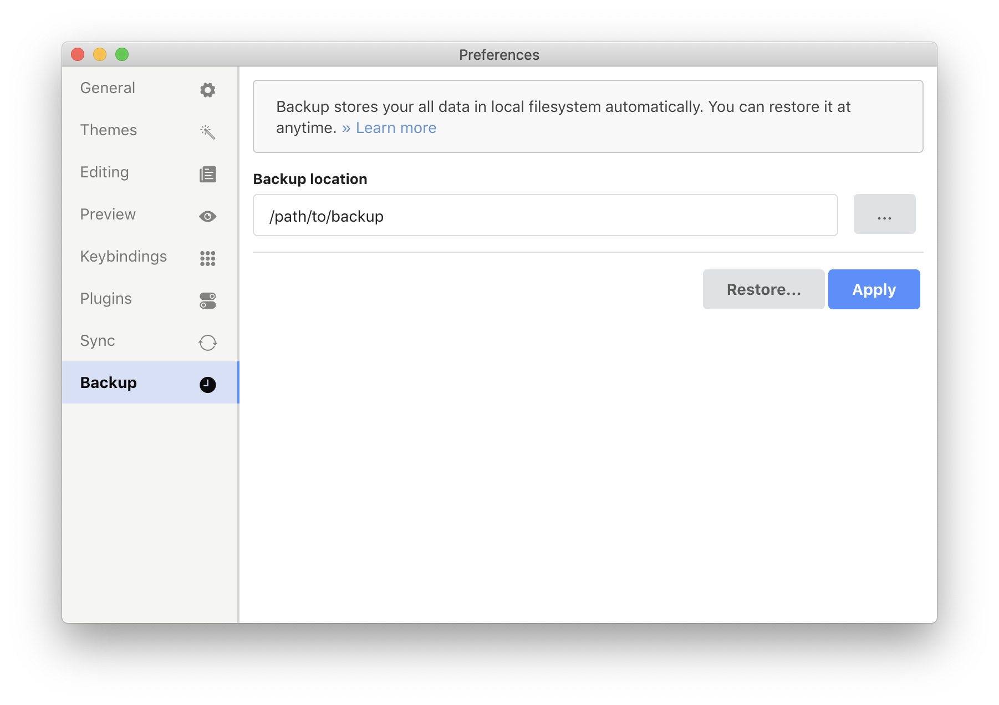
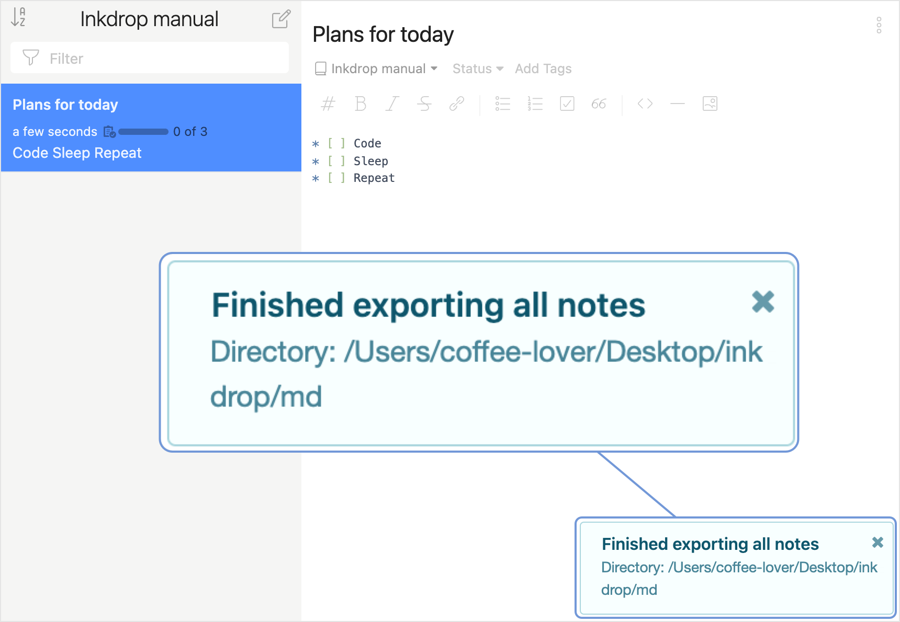

> We are not perfect human beings, nor do we have to pretend to be, but it is necessary for us to be the best version of ourselves we can be.

That's right, we aren't perfect. No matter how carefully you manage passwords, you may lose them for various reasons. No matter how carefully you operate your servers, you may lose your data. We can err and it's totally OK. The good thing is that we can have a plan 'B' in the pocket. 'B' stands for Backup as you can guess 😉

## Backup Inkdrop data

You can back up all your data to your local filesystem and restore from them anytime.
Inkdrop stores your data as the JSON files **continuously** while you use them. It works like a local replication.

To specify where to store your data, take the following steps:

1. Open **Preferences** by clicking the  icon. You can also use <kbd>Command+,</kbd>, or <kbd>Ctrl+,</kbd> on Windows.
2. In the opened window, go to **Backup **.
3. In the **Backup location** field, enter path to the folder where you want to store the notes data.  
   You can also select the desired folder by clicking **...** (the three dots button).
4. Click **Apply**.  
   From this moment, Inkdrop will store your notes data in the specified folder.

 <b>Note</b> that Inkdrop doesn't have a default backup folder. If you lost access to the account and hadn't made a backup, read <a href="https://docs.inkdrop.app/manual/salvage-data-from-local-database">Salvaging Data from Local Database</a>.

   

The backup folder contains three subfolders:

- **state** — stores service state information of a backup for each client.
- **data** — stores your notes, notebooks, attachments, tags, and their configurations.
- **\_deleted** — deleted documents will be moved here. You can move files from this folder to the **data** folder if you want to restore them.

## Restore data

To restore your data, take the following steps:

1. Open **Preferences** by clicking the  icon. You can also use <kbd>Command+,</kbd>, or <kbd>Ctrl+,</kbd> on Windows.
2. In the opened window, go to **Backup **.
3. Click **Restore...**.
4. In the opened window, select the folder where your store your data.
5. In the appeared dialog, click **Restore**.  
   You will see a dialog saying that the restoring has completed.

## Export data in Markdown

JSON isn't the only format to have your data in. You can also export all notes in Markdown:

1. On the menu bar, go to **File** > **Export** > **All Notes..**.
2. Select a folder where you want to export your notes.  
   When exporting is finished, you'll see the **Finished exporting all notes** message in the lower-right corner of the app:  
   
