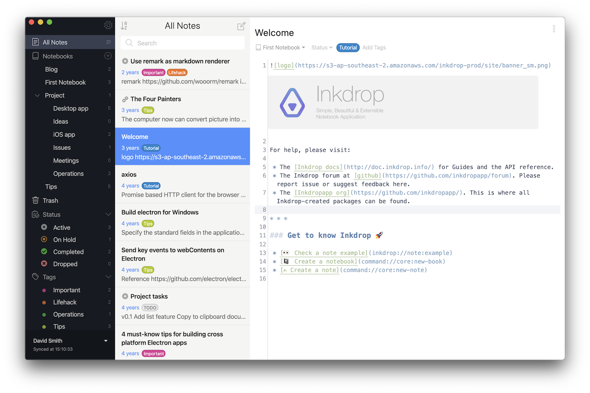
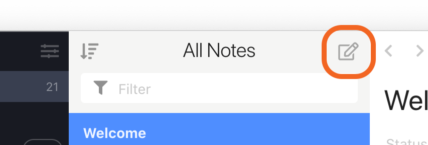
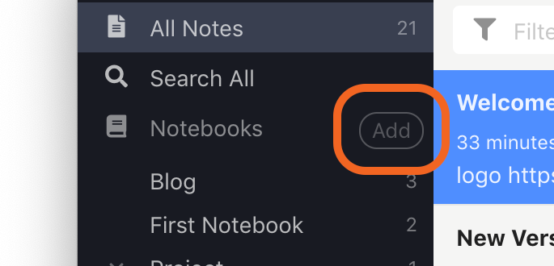
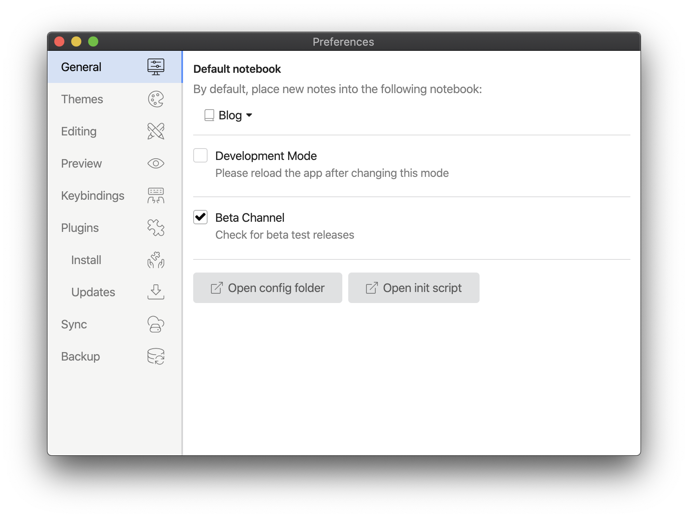

## Get acquainted with Inkdrop interface

Inkdrop interface is broken up into 3 main sections.

- **Sidebar** is the leftmost section. It lists notebooks, statuses, and tags.
  - Notebooks are like folders that store your notes. You can nest notebooks in one another as deeply as needed.
  - Statuses help you treat notes as tasks and, for example, display only active or completed ones.
  - Tags are like labels that let you link notes with one another. For example, if they relate to a common topic.
    You can toggle the Sidebar by using <kbd>Command+/</kbd> or <kbd>Ctrl+/</kbd> on Windows/Linux.
- **Note list** is located amid. All your notes live here ordered by modification date by default. You can search for notes via the search box at the very top of the section.
- **Editor** is the rightmost section. This is where your magic happens 🪄 — your workspace.

**More useful shortcuts:**

- <kbd>Command+E</kbd> or <kbd>Ctrl+E</kbd> — to switch between the editor and preview modes.
- <kbd>Command+P</kbd> or <kbd>Ctrl+P</kbd> — to display the editor and preview side-by-side.
- <kbd>Command+Shift+D</kbd> or <kbd>Ctrl+Shift+D</kbd> — to enter/leave the 'Distraction Free Mode' 🧘 Is when the sidebar and note list are hidden, and you can focus on the writing process.

## Create new note and notebook

To create a new note, you can either click the  icon on the right top of the note list or use the <kbd>Command+N</kbd> / <kbd>Ctrl+N</kbd> shortcut. The newly created note will appear in the **Note list** section.

To create a new notebook: 

* Click  next to **Notebooks**.

To create a sub-notebook:

1. Right-click the notebook and select **New Sub Notebook..**.
2. Enter a title for the sub-notebook.
3. Click **Create**.  
   The newly created sub-notebook appears inside the selected notebook.

## Browse viewed notes

As you view your notes, Inkdrop remembers in what order you opened them. It lets you go through the history of the viewed notes back and forth.

There're several options to see the viewed notes:

### Via keyboard

| macOS                             | Windows/Linux                 | Action              |
| --------------------------------- | ----------------------------- | ------------------- |
| <kbd>Command</kbd> + <kbd>←</kbd> | <kbd>Alt</kbd> + <kbd>←</kbd> | Go to previous note |
| <kbd>Command</kbd> + <kbd>→</kbd> | <kbd>Alt</kbd> + <kbd>→</kbd> | Go to next note     |

### Via application menu

To navigate between notes via the app menu:

* Click **View** and then select **Back** or **Forward**.

### Via mouse buttons

Some computer mouses have additional buttons that you can bind to navigate back and forth through your viewed notes.

### Using touchpad

You can use gestures on the touchpad to navigate the history of viewed notes.

The feature relies on the Electron's <a href="https://www.electronjs.org/docs/latest/api/browser-window#event-swipe-macos"><code>swipe</code></a> event which is only available for the macOS.
  
If you're a Windows user, check the <a href="#hack-windows-gestures">Hack Windows gestures</a> section.

Depedning on the macOS version, you can find the trackpad settings in different places.

#### macOS Ventura 13.2

1. Go to **System Settings** > **Trackpad**.
2. Select the **More Gestures** tab.
3. Next to the **Swipe between pages** action, select a gesture from the list. For example, **Swipe with Three Fingers**.  
   Use this gesture to navigate via the viewed notes in Inkdrop.

Watch a video showing how to navigate via the viewed notes using a touchpad on macOS.

<video controls playsInline muted>
  <source src="https://site-cdn.inkdrop.app/docs/manual/navigating-notes_history.mp4" type="video/mp4" />
</video>

#### Hack Windows gestures

By default, navigating through notes using touchpad on Windows machines isn't supported. Check out a workaround for Windows 11:

1. Go to **Bluetooth & devices** > **Touchpad** > **Advanced gestures**.
2. Expand the **Configure three-finger gestures**.
3. For the **Swipe left** gesture:  
   3.1. Select **Custom shortcut** from the list of actions.  
   3.2. Click **Start recording** and use the `Alt` + `←` keyboard shortcut.  
   3.3. Click **Stop recording**.
4. For the **Swipe right** gesture:  
   4.1. Select **Custom shortcut** from the list of actions.  
   4.2. Click **Start recording** and use the `Alt` + `→` keyboard shortcut.  
   4.3. Click **Stop recording**.  
   Now, you can use 3-fingers swipes left and right to go back and forth via the viewed notes.

Note that this workaround doesn't break browser navigation with the gestures.

### Set custom keyboard shorcuts

You can [set custom keyboard shortcuts](/manual/customizing-keybindings) for navigation through the visited notes. The commands for the navigation are:

* <a href="/manual/list-of-commands#corenavigate-back"><code>core:navigate-back</code></a>: To go to the previous note.
* <a href="/manual/list-of-commands#corenavigate-forward"><code>core:navigate-forward</code></a>: To go to the next note.

## Settings and preferences

Inkdrop has the **Preferences** view where you can fine-tune look and feel of the app. To open the **Preferences** view, take the following steps:

### macOS

Go to **Inkdrop** > **Preferences** in the menu bar. Alternatively, you can use the <kbd>Command+,</kbd> shortcut.

### Windows and Linux

Go to **File** > **Settings** in the menu bar. Alternatively, you can use the <kbd>Ctrl+,</kbd> shortcut.

And you will see the window like this:

## User data directory

Inkdrop stores your data and config locally at the following path:

- on macOS: `~/Library/Application Support/inkdrop/`
- on Windows: `%APPDATA%\inkdrop\`
- on Linux:
  - deb/rpm: `~/.config/inkdrop/`
  - Snap: `~/snap/inkdrop/current/.config/inkdrop/`

To open it in a file manager, go to **Preferences** > **General** and select **Open Config Folder**.

The config folder has the following files and folders:

- `config.cson` — app config file in the [CSON format](https://github.com/bevry/cson#what-is-cson)
- `keymap.cson` — keybindings config file in the [CSON format](https://github.com/bevry/cson#what-is-cson)
- `packages/` — installed plugins
- `db/` — local database
