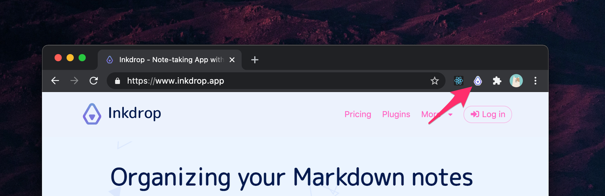
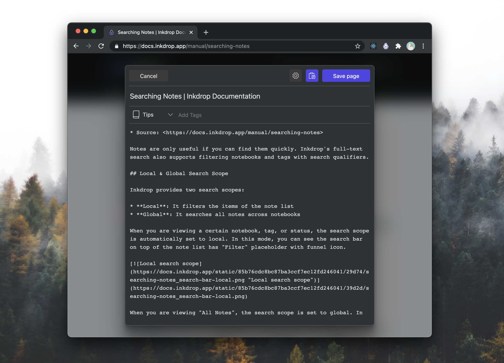

Inkdrop can clip web pages as Markdown via a browser extension.
It allows you to grab the web page's main article or selection.

## Prerequisites

The browser extension stores the clipped data to the Inkdrop app **locally**, not to the Inkdrop server directly
because the app syncs data securely via the end-to-end encryption.
To accomplish that, you have to set up [a local Inkdrop server](/manual/accessing-the-local-database/#accessing-via-http-advanced) beforehand so that the browser extension can access your local database.

## Install Web Clipper

- [Chrome Extension](https://chrome.google.com/webstore/detail/inkdrop-web-clipper/foeipofmnkjhlbojckgiecdffbfnnofj)
- [Firefox Add-on](https://addons.mozilla.org/en-US/firefox/addon/inkdrop-web-clipper/)

## Set up Web Clipper

The web clipper needs to know how to access your local database server [configured in your `config.cson`](/manual/accessing-the-local-database/#accessing-via-http-advanced).

- **Inkdrop Local Database URL** (Optional) - The URL to the local database as you configured in `core.server.port`. Default is `http://localhost:19840`
- **Username** (Required) - The Basic auth username as you configured in `core.server.auth.username`.
- **Password** (Required) - The Basic auth password as you configured in `core.server.auth.password`.

## Steps to Clip a Web Page

First, click the Inkdrop toolbar button on the top right corner of the browser:

Then, a web clipper window opens up, displaying the main content converted as Markdown, as following:

You can choose a notebook and add tags if you want.

If you want to clip a part of the web page, select the part and click the Inkdrop toolbar button.

Click "Save page" button, then the window will close and the clipped page will be saved.
