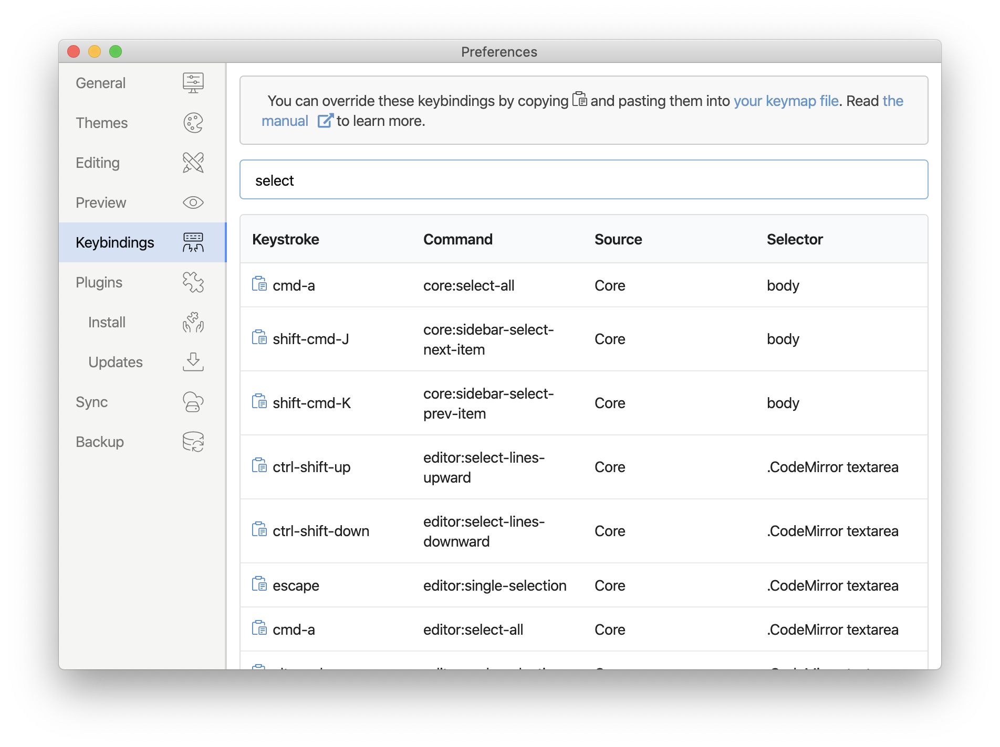

Inkdrop keymaps work similarly to stylesheets.
Just as stylesheets use selectors to apply styles to elements, Inkdrop keymaps use selectors to associate key combinations with events in specific contexts.
Here's a small example, excerpted from Inkdrop's built-in keymap:

```coffeescript
'.CodeMirror textarea':
  'enter': 'editor:new-line'

'body .native-key-bindings':
  'enter': 'native!'
```

This keymap defines the meaning of `Enter` in two different contexts.
In a normal editor, pressing `Enter` triggers the `editor:new-line` command, which causes the editor to insert a newline.
But if the same keystroke occurs outside the editor, it instead triggers the native behavior.

By default, `keymap.cson` is loaded when Inkdrop is started.
It will always be loaded last, giving you the chance to override bindings that are defined by Inkdrop's core keymaps or third-party packages.

You can see all the keybindings that are currently configured in your installation of Inkdrop in *Keybindings* section on *Preferences* window:



By clicking **your keymap file** on the top of this section, you can open up the file.

## Global keybindings

There is a special selector called `global` which lets you configure global keybindings.
You can run a command when the app does not have keyboard focus.

### Show and focus Inkdrop main window

```coffeescript
'global':
  'cmd-shift-x': 'application:show-and-focus-main-window'
```
