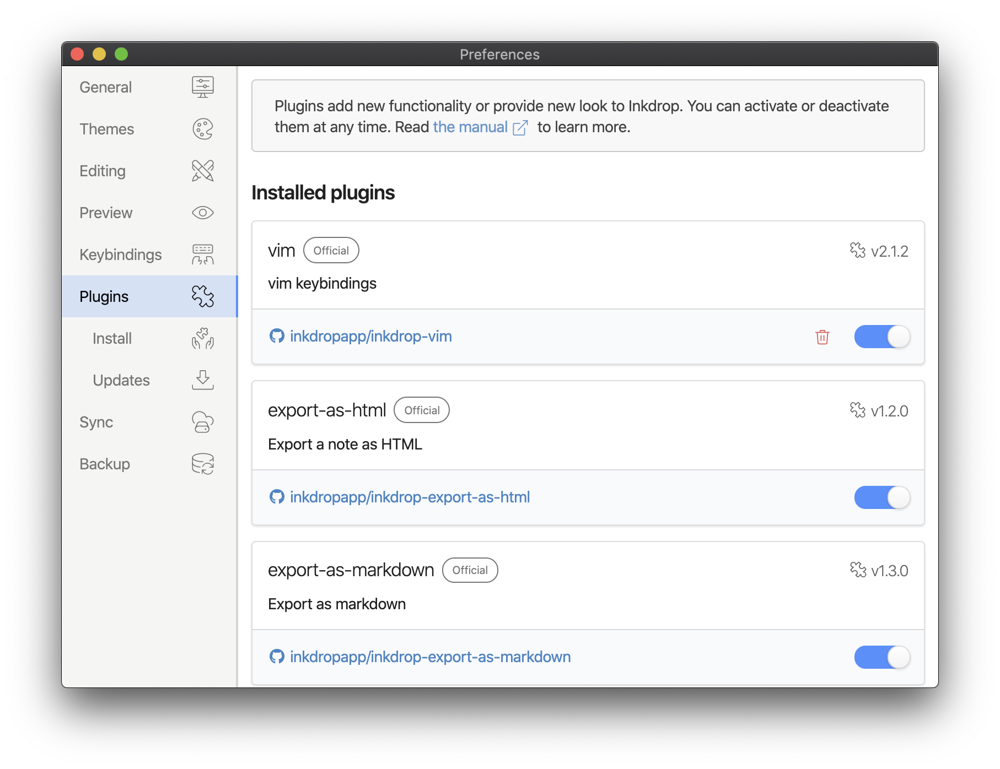
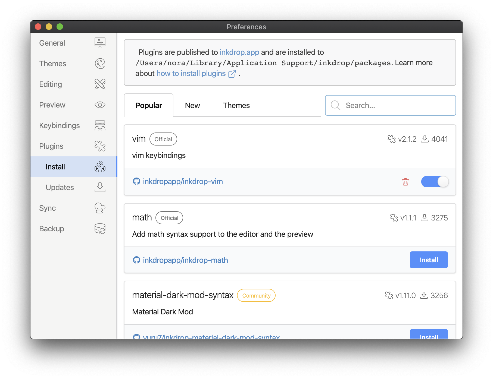
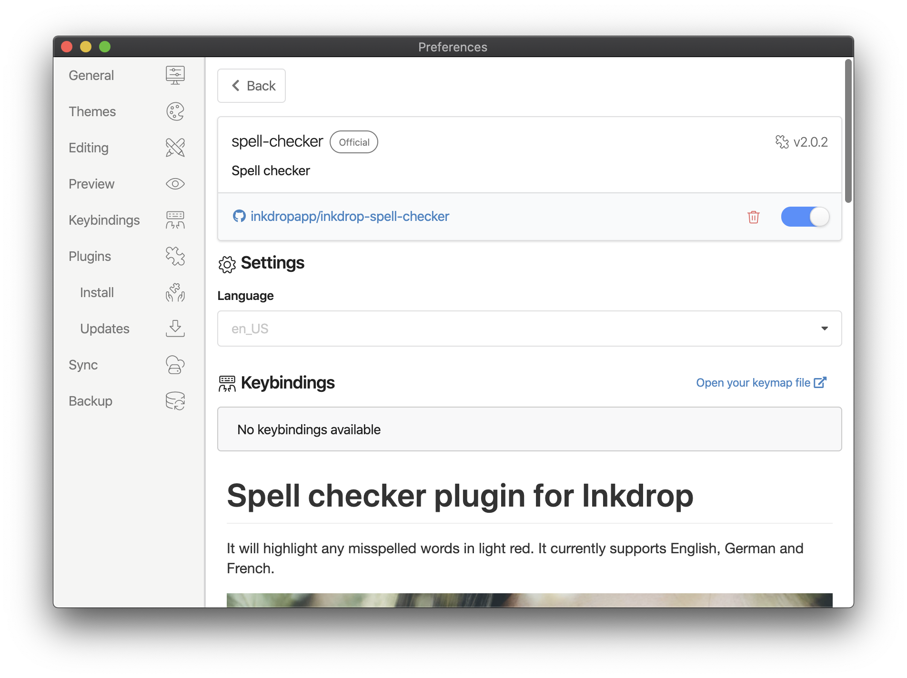
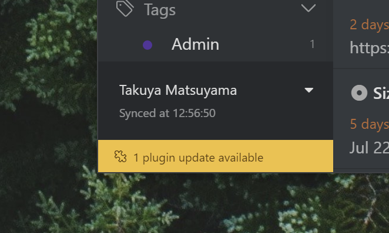
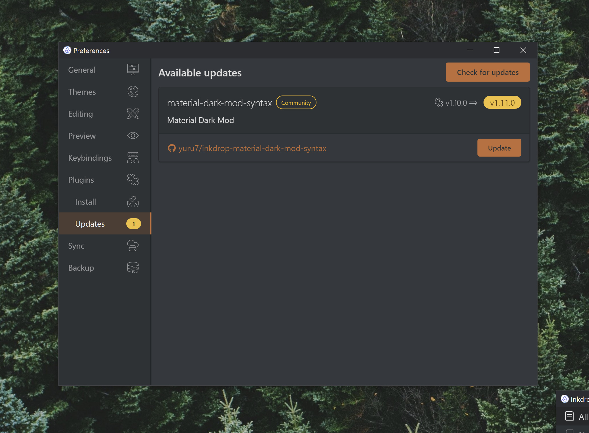
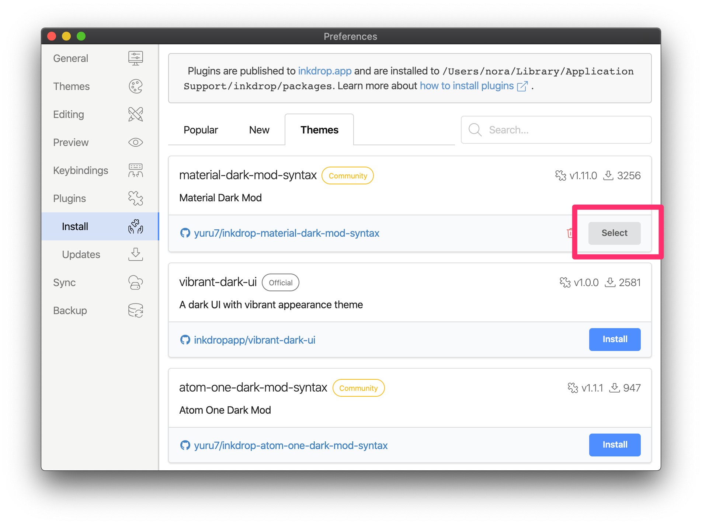
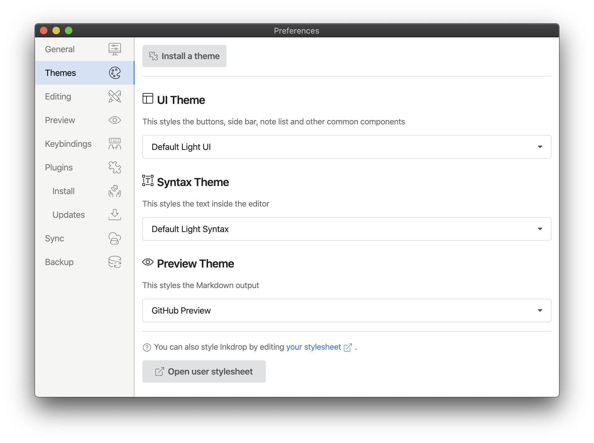

Plugins add new functionality or provide new look to Inkdrop.
There are more than 100 plugins registered on [the Inkdrop plugin registry](https://my.inkdrop.app/plugins).

Why do you need plugins?
Markdown is a very simple markup language with plain-text-formatting syntax.
Because of its simplicity, people have been customizing it for their use-cases.
So, there are a lot of 'flavors' of Markdown extended by the third parties such as GitHub.
You may like one of the flavors already.
For example, you may want to write math forumulas with LaTeX syntax, but Markdown itself does not support it by default.
You can use [math](https://my.inkdrop.app/plugins/math) plugin to make Inkdrop support to render math.
Those language extensions make Markdown incredibly powerful and help you write notes effectively.

Plugins can also change everything from the very look and feel of the entire interface to the basic operation of even core functionality.
For example, [vim](https://my.inkdrop.app/plugins/vim) plugin provides Vim keybindings.
[nord-ui](https://my.inkdrop.app/plugins/nord-ui) provides [Nord theme](https://www.nordtheme.com/) to the Inkdrop UI.

You can activate or deactivate them at any time.
Go to _Preferences > Plugins_ on macOS or _File > Settings > Plugins_ on Windows and Linux to see a list of what’s installed.
You should see some default plugins are already installed.



## Install plugins

In order to install new plugin, you can use the Install tab in the Preferences window.



Type your search query into the input box on the right hand of the pane.
All of the plugins will come up with an "Install" button.
Clicking that will download the plugin and install it.
Your note app will now have the functionality that the plugin provides.

### Mobile

Some plugins are bundled in the mobile app as Markdown renderer options.
Go to `Preferences > Markdown Renderer` and you will see the list of available options:


## Plugin settings

Once a plugin is installed in Inkdrop, it will show up in the Preferences window under the "Plugins" tab, along with all the pre-installed plugins that come with Inkdrop.



Clicking the plugin will give you the settings screen for that plugin specifically.
Here you have the option of changing some of the default variables for the plugin, seeing what all the command keybindings are, disabling the plugin temporarily, looking at the source code, seeing the current version of the plugin and uninstalling the plugin.

## Keep plugins up to date

If a new version of any of your plugins is released, Inkdrop will automatically detect it and notify you like this:



Clicking the notification will give you the update screen where you can see the plugins that have the new version.
By clicking "Update" button for the plugin, you can quickly update it.
This helps you easily keep all your installed plugins up to date.



## Change themes


There are three types of themes in Inkdrop:

- **UI Theme** - Theme for Inkdrop UI
- **Syntax Theme** - Theme for Markdown editor
- **Preview Theme** - Theme for Markdown preview

Once you installed theme plugins, you can activate it by pressing "Select" button for the theme:



Or, you can use the Themes tab in the Preferences window:



## Command line (ipm - Inkdrop Plugin Manager)

<div class="ui message">
  <b>ipm</b> is a fork of <a href="https://github.com/atom/apm">apm (atom package manager)</a>, some output messages may include Atom-related though, please ignore them. 😉
</div>

<div class="ui warning message">
  If you are using beta version of the app, please note that the command name is <b>ipm-beta</b>.
</div>

You can also install packages or themes from the command line using `ipm`.

### macOS

When you first open Inkdrop, it will try to install the `ipm` command for use in the terminal.
If the `ipm` command has been installed, you'll see something like this:

```bash
$ which ipm
/usr/local/bin/ipm
```

You can also manually install `ipm` from `Inkdrop -> Install Shell Commands` from the menubar.

### Windows

The setup program will automatically install `ipm` command, and add it to your `PATH`.
The ipm command can be found in `C:\Users\<USER>\AppData\Local\inkdrop\bin`.

### Linux

`ipm` is not installed automatically.
The command is available in the path of `<path-to-inkdrop>/resources/app/ipm/bin/ipm`.
For example, on Ubuntu the path to ipm is `/usr/lib/inkdrop/resources/app/ipm/bin/ipm`.

If you have installed via Snap, `inkdrop.ipm` command is available in the path of `/snap/bin/`.

### Finding new plugins

You can also use `ipm` to find new plugins to install. If you run `ipm search`, you can search the plugin registry for a search term.

```bash
$ ipm search emoji
Search Results For 'emoji' (1)
└── markdown-emoji Add emoji syntax support to Inkdrop markdown editor (0 downloads, 0 stars)

Use `ipm install` to install them or visit https://my.inkdrop.app/plugins to read more about them.
```

### Installing plugins

Once you found new plugins to install, you can install them by using the `ipm install` command:

- `ipm install <package_name>` to install the latest version.
- `ipm install <package_name>@<package_version>` to install a specific version.

For example `ipm install markdown-emoji@0.1.0` installs the 0.1.0 release of the [markdown-emoji](https://my.inkdrop.app/plugins/markdown-emoji) package.

### Updating plugins

You can update outdated plugins like so:

```sh
$ ipm update
Package Updates Available (1)
└── vim 2.0.0 -> 2.0.1

Would you like to install these updates? (yes) yes

Installing vim@2.0.1 to /Users/nora/.inkdrop/packages ✓
```

If there are no updates available, you will get:

```sh
$ ipm update
Package Updates Available (0)
└── (empty)
```

### Uninstalling plugins

You can also uninstall the plugin by running below command:

```
$ ipm uninstall <package_name>
```
