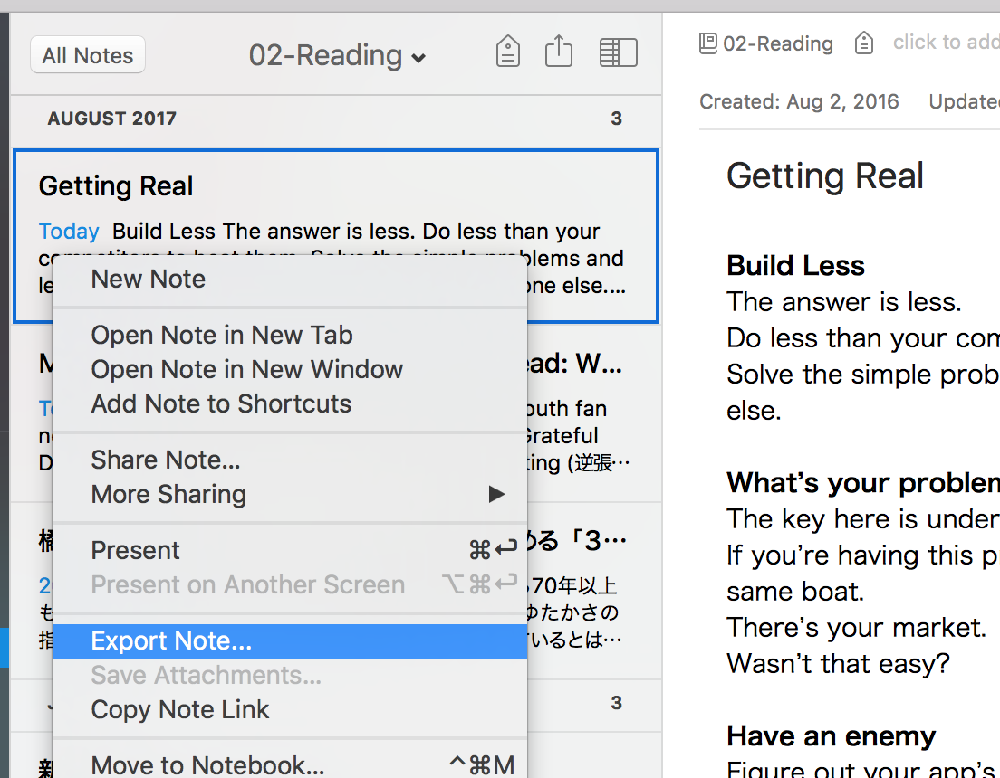

You can import notes from HTML files.
It comes in handy when you would migrate your notes from other note-taking apps such as Evernote.

## Export Notes as HTML files from Evernote

Evernote has a feature to export notes as HTML. Select a note or multiple notes you wish to export and right-click, then select “Export Note…” menu like following:

‘Export Selected Notes’ dialog will show up. Please choose HTML as an output format, then click ‘Save’ button.

You will get HTML files on your disk.

## Import Notes from HTML Files

Now let’s import them. Select ‘_Inkdrop -> Import -> from HTML files…_’ from menu.

A dialog showing up, which asks you to select which notebook to be the destination. Once choosed a notebook, click ‘OK’ button. You will see the open file dialog, then select the HTML files you have been exported from Evernote. That’s it!
