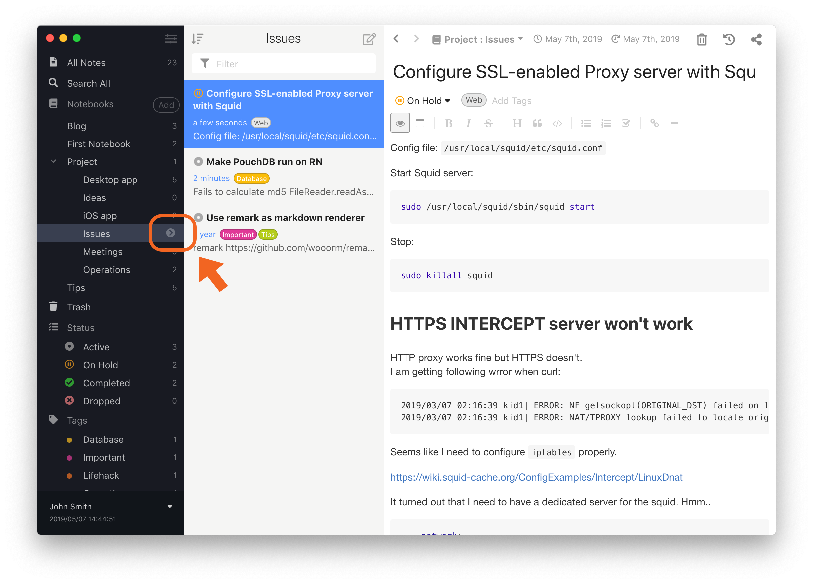
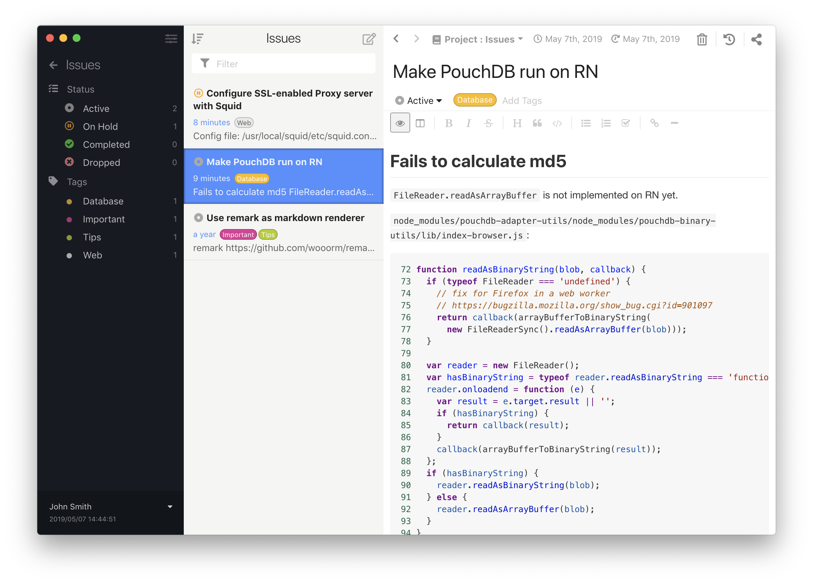

With your notes having organized with notebooks, tags and status, Inkdrop can help you navigate them elegantly.

## Notebook Submenu

When an item of notebook list gets hovered or selected, a chevron will appear.
You can click it to look into the overview of the notebook like so:

The sidebar lists statuses and tags that are associated with notes in the notebook. 
So you can navigate notes in a particular notebook based on tags and status.
