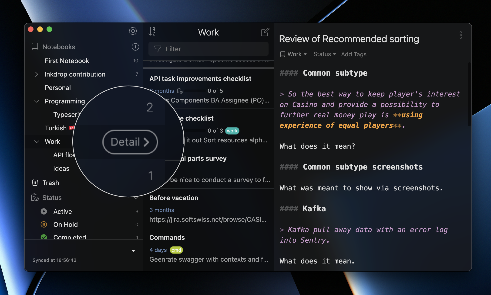

One of the ways to think about notebooks is like separate projects. Every notebook covers a specific topic and can be divided into sub-notebooks. Every (sub)notebook has a list of notes, and every note can have [tags](/manual/write-notes#tag-notes) and [statuses](/manual/managing-tasks-with-status). When the number of notebooks or their content grows, notebooks management can become a nightmare.

Inkdrop lets you gracefully organize the notebooks, declutter your workspace, and display the information that belongs to a specific notebook.

## View notebook-specific notes

To view the notes belonging to a specific notebook:

* Click  next to the notebook's title.

When a notebook is expanded, the note list shows the notebook's direct notes. The **Project** notebook in the image below has only one note.

When a notebook is collapsed, the note list shows direct notes from the collapsed notebook and all of its sub-notebooks.

## View notebook-specific statuses and tags

By default, the sidebar shows all notebooks, statuses, and tags fetched from the database.
They're mixed together, and it can be challenging to understand which entity belongs to which notebook. 

To display entities of a specific notebook:

* Hover over the notebook and click **Detail** next to its name. You can also open a notebook and press <kbd>Enter</kbd>.  
  The sidebar only shows sub-notebooks, statuses, and tags of the selected notebook so you can focus on specific information.

### Mobile

To display notebook-specific entities on a mobile device:

* Select **Detail** next to the desired notebook.

