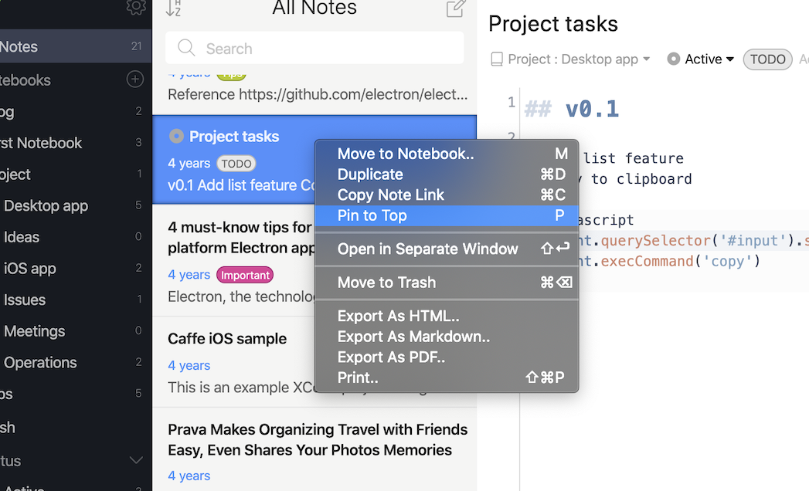
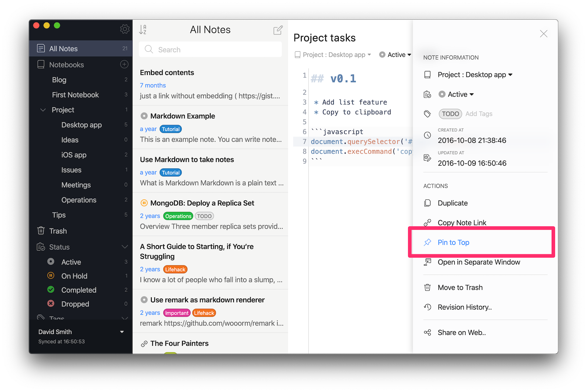

Let's say you sometimes have trouble remembering which notes you were working on in Inkdrop.
It's time to use "Pin to Top" feature, which allows you to make notes stick to the top of your notes list.

There are several ways to pin/unpin notes.

## via context menu or shortcut key

Right-click the note you wish to pin/unpin and select "Pin to top" / "Unpin from top" menu.
You can also toggle pinned state by pressing <kbd>P</kbd> on the note list.

## via the editor drawer

Press the three dash icon on the top right corner of the editor or press <kbd>Cmd + J</kbd> on macOS or <kbd>Ctrl + J</kbd> on Windows and Linux, and the editor drawer appears.
Then, click "Pin to Top" / "Unpin from Top" menu.
