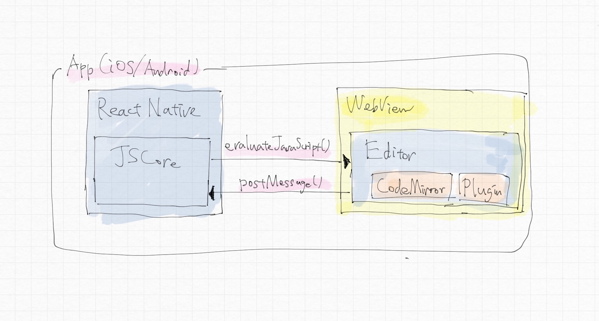
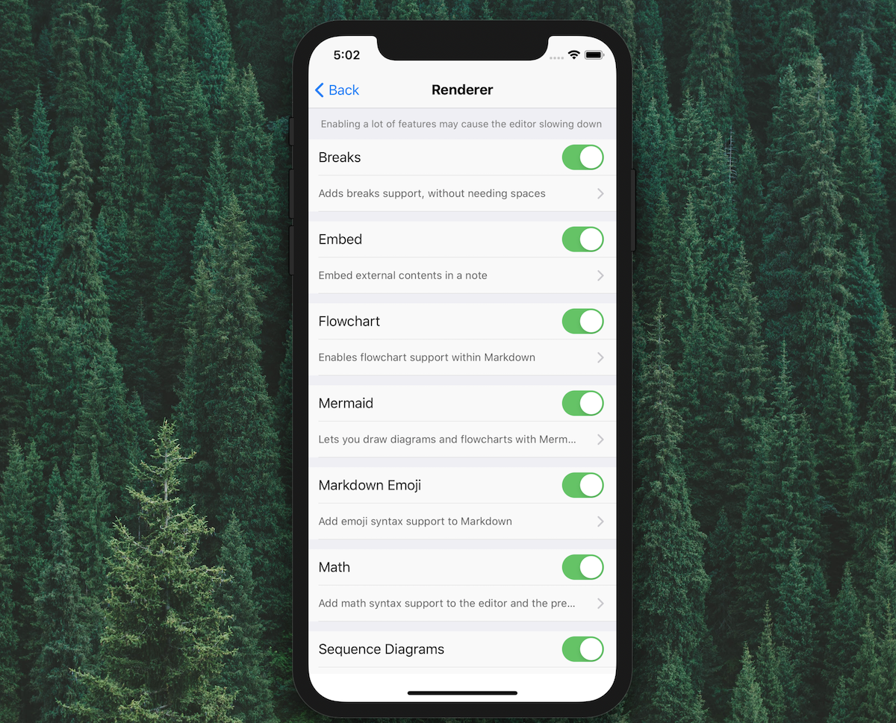

## Your plugin will be bundled as an advanced Markdown renderer option

Extending Markdown renderer in the mobile app is also supported by the similar way as the desktop app.
But as [Apple prohibits loading dynamic scripts that change the app's functionality](https://blog.inkdrop.app/a-promising-idea-towards-supporting-plugins-for-ios-app-5f7803715be7), it has to be bundled at the compilation time.
Plugins are displayed as _"Advanced Markdown renderer options"_.
So, basically, it is for adding features for the Markdown renderer like [math](https://github.com/inkdropapp/inkdrop-math).

You can extend the editor part since it is web-based.
Extending functionalities of outside the webview is not possible.
The below diagram illustrates its architecture:



## Compatibility

You can build a plugin just as you build for the desktop app.
Read [the tutorial here](/manual/plugin-word-count) to learn how to build a plugin for desktop.
But there are some limitations.
As the above section mentioned, you can only extend Markdown renderer with plugin.

There is [`inkdrop` global variable](/reference/environment) which provides only the following properties:

- [commands](/reference/command-registry)
- [config](/reference/config) - Read only
- [packages](/reference/package-manager)
- [styles](/reference/style-manager)
- [store](/reference/store)

[Markdown renderer module](/reference/markdown-renderer) is available.

If you have LESS stylesheets in a plugin, it will be pre-compiled into CSS.
Similarly, your ES6 JavaScript will be compiled beforehand.

## How to register your plugin

There is not a plugin registry like **ipm**.
You have to make a pull request to [the plugin repository](https://github.com/inkdropapp/inkdrop-mobile-plugins).
Here is a step-by-step instruction for adding your plugin into the mobile app.

### Update your plugin for mobile

#### Add README-mobile.md

It is a documentation for mobile.
Basically you can reuse your README.md but you have to remove sections for desktop like "How to install".

#### Remove "plugin" words from your plugin description

You can not use "plugin" or any words like "extension" in your package description or readme.
Because your plugin will be displayed as one of renderer options like so:



### Make a fork of inkdrop-mobile-plugins

Fork [inkdrop-mobile-plugins](https://github.com/inkdropapp/inkdrop-mobile-plugins) repository.
Then, clone it:

```sh
git clone https://github.com/<YOUR_FORK_OF_inkdrop-mobile-plugins>.git --recursive
cd inkdrop-mobile-plugins
```

### Add submodule

Plugins are stored in `./packages` directory as git submodule.
Run the following command:

```sh
git submodule add <YOUR_PLUGIN_REPO_URL> packages/<PLUGIN_NAME>
```

### Edit package.json

Add your plugin to `devDependencies` like so:

```json
  "devDependencies": {
    "math": "file:packages/math",
  }
```

Then, run `npm install`.

### Build

Run the following command:

```sh
npm run build
```

### Test

Add a test for your plugin to `test/index.js` to make sure it gets loaded properly.

For example:

```js
test.serial.cb('mermaid', t => {
  global.window.inkdrop.packages.setPackageMainModule = (name, p) => {
    t.is(name, 'mermaid')
    t.is(p instanceof Object, true)
    t.is(typeof p.activate, 'function')
    t.is(typeof p.deactivate, 'function')
    t.end()
  }

  require('../lib/mermaid')
})
```

Then, run the test:

```sh
npm t
```

Did it work? Okay, now it's time to make a PR :)

## How to debug your plugin

Build plugin metadata:

```sh
npm run build:index
```

Launch webpack server:

```sh
npm run dev:server
```

Then, open up a debugger tool:

[https://inkdrop-mobile-plugin-debugger.netlify.com/](https://inkdrop-mobile-plugin-debugger.netlify.com/)

Open Developer Tools and you should see like this:


