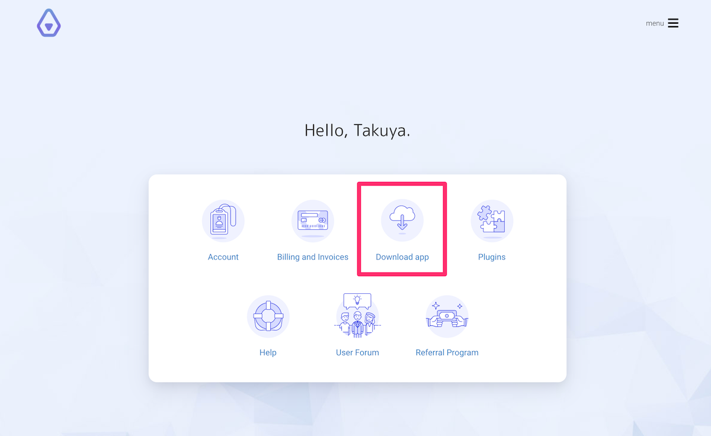
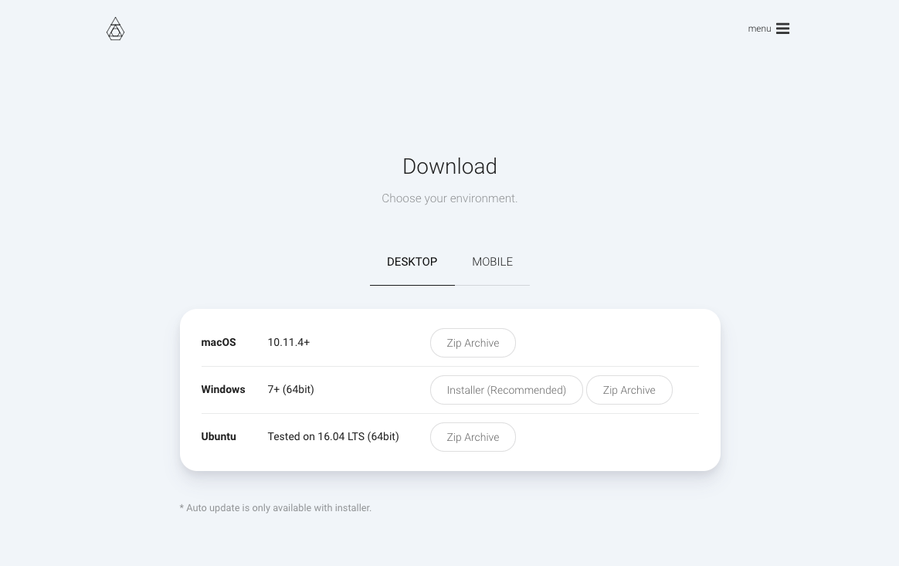

Welcome to Inkdrop! Here's how to get started.
To get started with Inkdrop, we'll need to get it on your system.

## Creating your Inkdrop account

First, go to [Inkdrop website](https://inkdrop.app/) and sign up.
Inkdrop will prepare new database for storing your note data.
Also your account can be used for publishing your plugins and so on.

## Downloading the app

After you set up an account and log in, you should see a download button as shown here:



Desktop application is ready for macOS, Windows and Linux, so choose one for your environment:



## Installing Inkdrop on macOS

Inkdrop follows the standard Mac zip installation process. You can download the `Inkdrop-x.y.z-Mac.zip` file from the Inkdrop website. Once you have that file, you can click on it to extract the application and then drag the new Inkdrop application into your "Applications" folder.

## Installing Inkdrop on Windows

Inkdrop is both available with a Windows installer and zip archive. The installer is recommended because it can provide auto-update features which automatically update to the latest version of the Inkdrop app.

## Installing Inkdrop on Linux

To install Inkdrop on Linux, you can download a Debian package, a RPM package or a zip archive.
The packages do not have auto-update features.
So when you would like to upgrade to a new release of Inkdrop, you will have to repeat this installation process.

To install Atom on Debian, Ubuntu, or related systems:

```bash
# Install Inkdrop
sudo dpkg -i inkdrop_x.y.z_amd64.deb

# Install Inkdrop's dependencies if they are missing
sudo apt-get -f install
```

## Log in

When you first open Inkdrop, you should see Log-in screen like this:


Enter your email address and password to get started.

