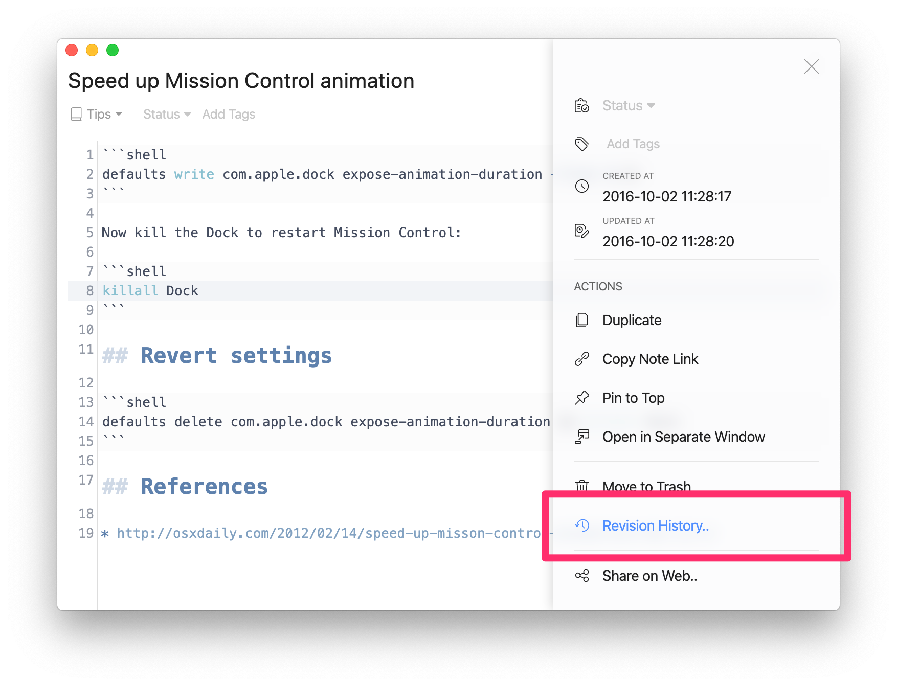
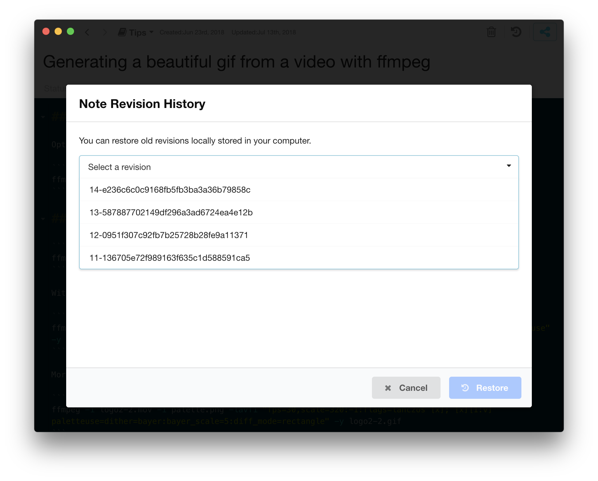
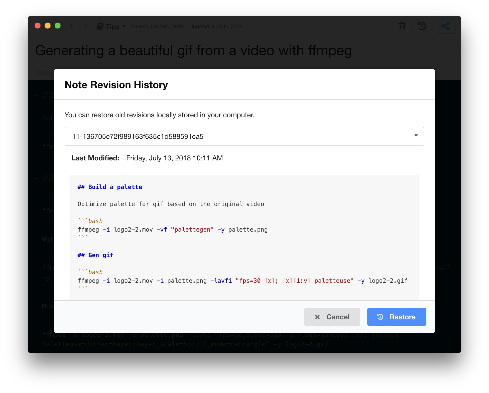
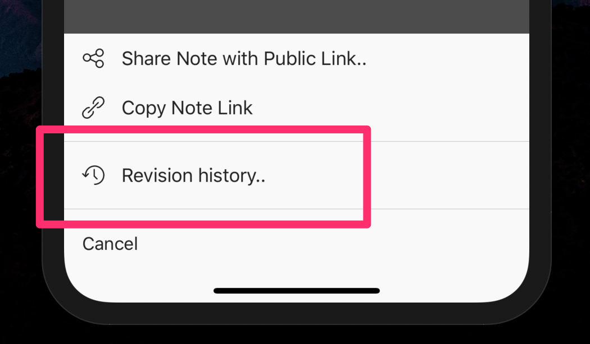
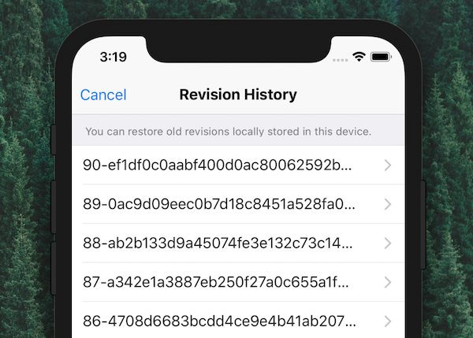
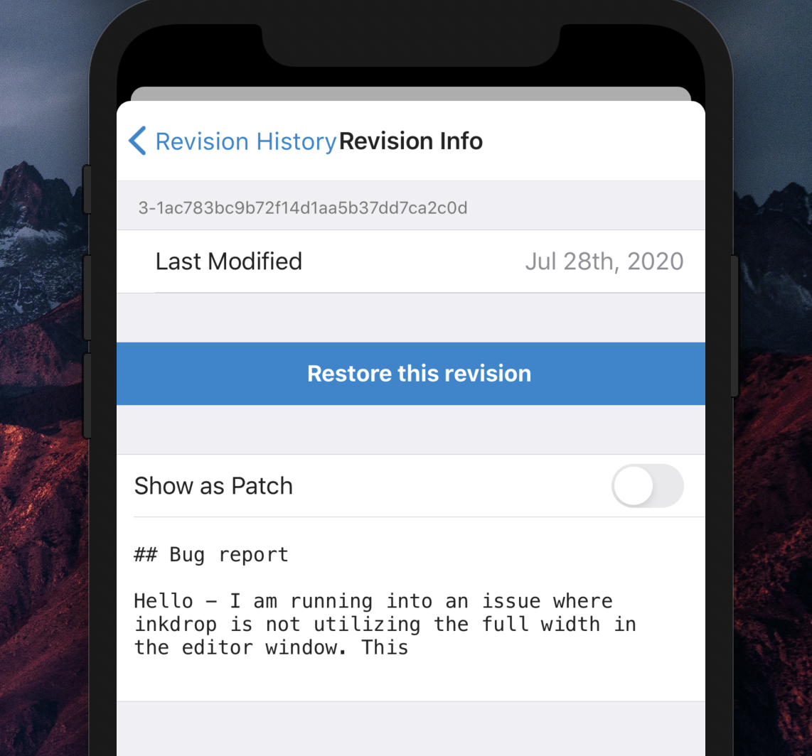

Inkdrop keeps your notes with revision history locally.
That means every time you saved a note after finished editing, the app creates new revision for the note.

If you accidentally made an unwanted change to a note, no worries.
The app provides a way to access old revisions of notes so you can restore them anytime.

**NOTE:** You can't access old revisions that have been made on other devices. Because Inkdrop syncs only the latest revision of your notes across devices. Inkdrop database erases old revisions automatically for saving its storage capacity.

## How to restore old revisions

### Desktop

1. Open up a note
1. Click the three-dash button on the top right corner of the editor, or press <kbd>Cmd + J</kbd> on macOS or <kbd>Ctrl + J</kbd> on Linux and Windows
1. Click _"Revision History.."_ menu on the editor drawer
   
1. Select a revision by clicking a dropdown list
   
1. Check if the selected revision is ok to restore. Click _Restore_ button
   

If you would like to undo restoring the revision, just press `Ctrl-Z` or `Cmd-Z` (Command: `core:undo`).

### Mobile

1. Open up a note
2. Tap "..." button on the right of the navigation bar
3. Select _Revision history.._ menu
   
4. Select a revision from the list
   
5. Check if the selected revision is ok to restore. Tap _Restore_ button
   
