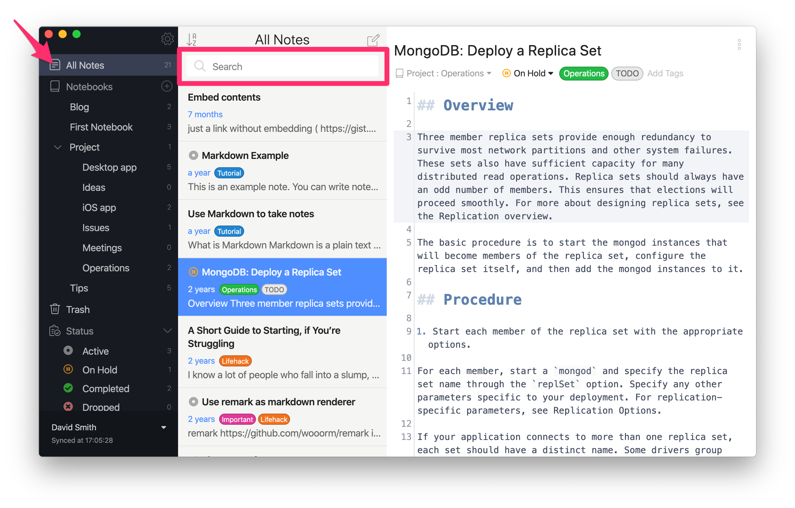
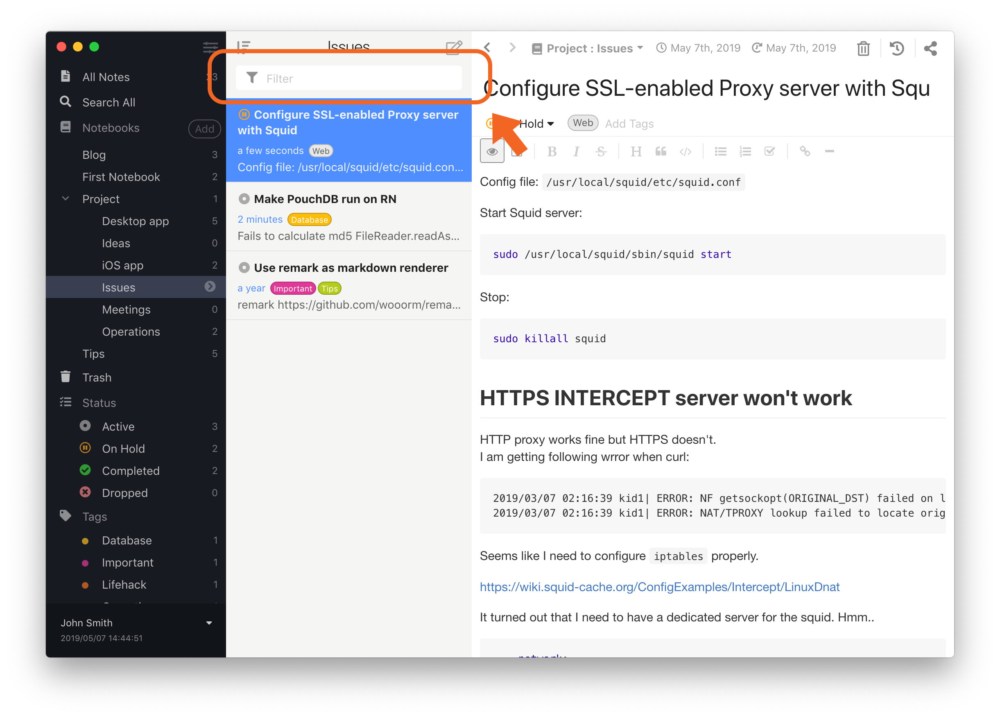

Inkdrop has a robust search to find the needed notes quickly. You can look for the content among all notes or narrow the search to a specific notebook. Inkdrop also supports special qualifiers for more accurate results.

## Page overview

This section lists topics you'll learn from the page.

- Searching among all notes in your Inkdrop.
- Filtering notes within a single notebook.
- Specifal qualifiers to refine the search results.
- Keyboard shortcuts essential for working with search.

## Search vs. filter

First, let's define the difference between searching for and filtering notes. 

- **Searching**: Inkdrop looks for notes among all the records in the database. You can think of it as a global search.
- **Filtering**: Inkdrop looks for the notes only within a specific notebook. You can think of it as a local search.

## Search for notes globally

The  icon in the search box means that Inkdrop will search for the query through all your notes.



To search globally, take the following steps:

1. In the sidebar, go to **All Notes**.
1. At the top of the note list, in the search box, enter a word or phrase.  
   As you enter, Inkdrop looks for the notes and displays the ones matching your query.
1. Optional. Go to a matched note in the note list.  
   The matched words and phrases are highlighted. The color varies depending on your current theme.

## Search for notes locally

The  icon in the search box means that Inkdrop will search only in the selected notebook.



To search locally, take the following steps:

1. Select a notebook. 
1. At the top of the note list, in the search box, enter a word or phrase.  
   As you enter, Inkdrop looks for the notes and displays the ones matching your query.
1. Optional. Go to a matched note in the note list.  
   The matched words and phrases are highlighted. The color varies depending on your current theme.


## Keyboard shortcuts

| Action                            | macOS                                                                   | Windows/Linux                                                     |
|-----------------------------------|-------------------------------------------------------------------------|-------------------------------------------------------------------|
| Focus the search box              | <kbd>Command</kbd> + <kbd>Shift</kbd> + <kbd>F</kbd>                    | <kbd>Ctrl</kbd> + <kbd>Shift</kbd> + <kbd>F</kbd>                 |
| Switch to global search | <kbd>Command</kbd> + <kbd>Option</kbd> +<kbd>Shift</kbd> + <kbd>F</kbd> | <kbd>Ctrl</kbd> + <kbd>Alt</kbd> +<kbd>Shift</kbd> + <kbd>F</kbd>

Clear the search box:

* Select <kbd>Esc</kbd>

### Customize keyboard shortcuts

Read how to [reassign the default keyboard shortcuts](https://docs.inkdrop.app/manual/customizing-keybindings).

Commands related to the search box: 

* [`core:find`](https://docs.inkdrop.app/manual/list-of-commands#corefind): Focus the search box.
* [`core:find-global`](https://docs.inkdrop.app/manual/list-of-commands#corefind-global): Switch to global search.
* [`core:clear`](https://docs.inkdrop.app/manual/list-of-commands#corefind-clear): Clear the search box.

## Use special qualifiers to narrow down results

You can use special qualifiers to get more accurate results. See the qualifiers and their usage examples:

* **book**  
  `book:Blog`: Searches for notes in the 'Blog' notebook.
* **tag**  
  `tag:JavaScript`: Searches for all notes having the 'JavaScript' tag. Read more about [tags](https://docs.inkdrop.app/manual/write-notes#tag-notes).
* **status**  
  `status:onHold`: Searches for all notes with the 'On hold' status. Read more about [statuses](https://docs.inkdrop.app/manual/managing-tasks-with-status).
* **title**  
  `title:"JavaScript setTimeout"`: Searches for the note with the specified title.
* **body**  
  `body:KEYWORD`: Searches for a specific word in all notes. Equivalent to a [global search](#search-for-notes-in-all-notebooks).

### Combine qualifiers 

You can combine the filter qualifiers. 

**Find notes that contain the word 'Hello' and have the 'Issue' tag.**

```
Hello tag:Issue
```

**Find notes that contain the word 'Typescript,' have the 'Contribution' tag, and the 'Completed' status**

```
Typescript tag:Contribution status:Completed
```

## Search for text with spaces

To find the text that includes spaces, put the text into the double quotation marks ("):

```
"database associations"
```

## Exclude text from search

To exclude text from the search results or ignore a specific qualifier, put the minus sign (-) before it. You can also combine the exclusions. See the examples:

* `-book:Backend "closure functions"`: Ignores the 'Backend' notebook while searching for the 'closure functions' phrase.
* `-tag:JavaScript`: Ignores all notes having the 'JavaScript' tag.
* `-book:Typescript tag:work "Data types"`: Ignores the 'Typescript' notebook and the 'work' tag while searching for the 'Data types' phrase.
* `-status:dropped title:"Sprint 10.0" debounce`: Ignores notes with the 'Dropped' status while searching for the 'debounce' word in the note with the 'Sprint 10.0' title.
* `-"Phrase to ignore" "in the rest of a sentence"`: Ignores the 'Phrase to ignore' part while searching for 'in the rest of a sentence'.

Note that you can't specify excluding modifiers only without including conditions.
<div class="ui warning message">
Make sure to enter a text to search for after the exclusion modifier. <br><br>
<b>Will work ✅</b><br><code>-book:Backend "closure functions"</code><br><br>
<b>Won't work ⛔️</b><br>
<code>-book:Backend</code>. There's no query. Inkdrop doesn't understand what to search for.
</div>

## Caveats

Inkdrop uses SQLite full-text search engine to look for notes in a most efficient way. It's achieved by tokenizing text into words and ranking them based on [TF-IDF](https://sqlite.org/fts5.html). A limitation of the technology is that it doesn't support partial-match keywords. For example, you can't find notes containing 'string' while searching for 'trin'.
