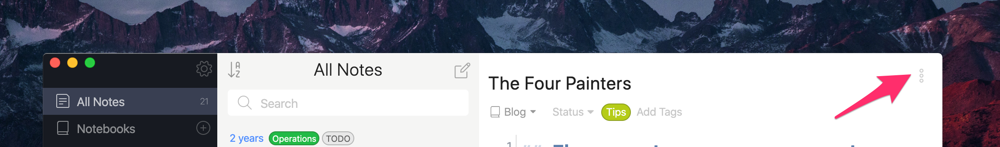
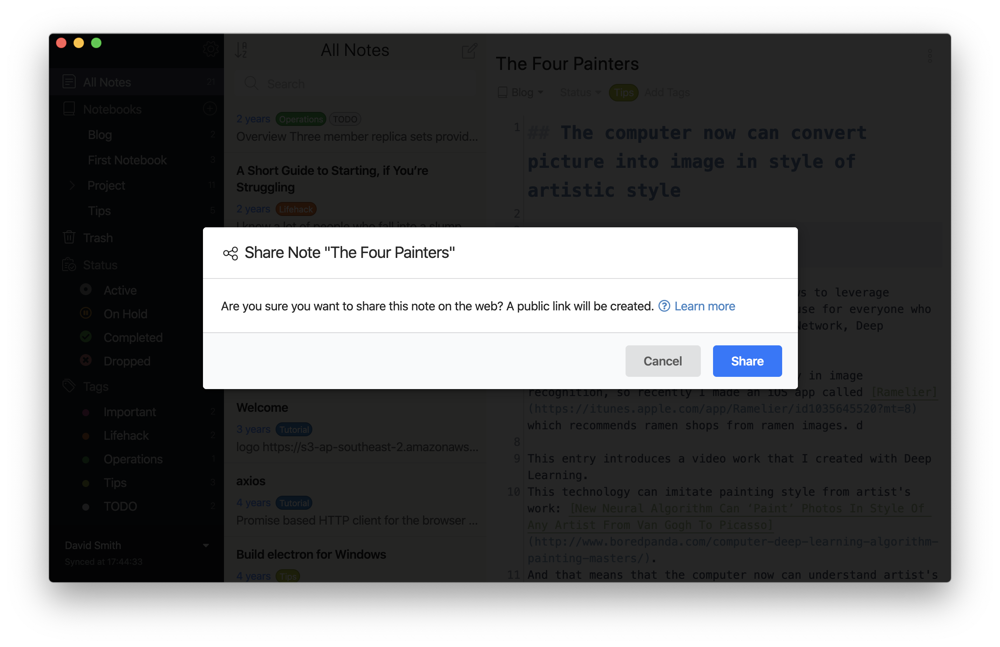
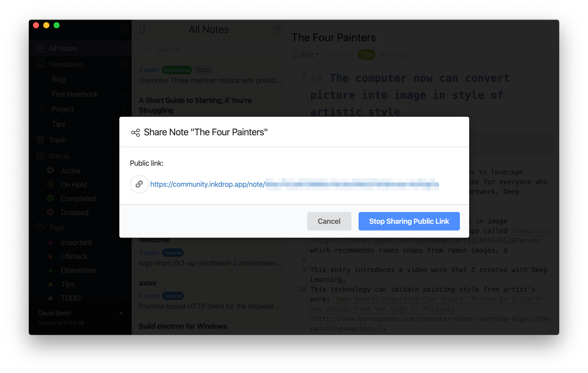

Publishing notes on the web comes in handy if you are working on a team project or just passing along useful tips to friends.
It allows you to share your Markdown notes with anyone, even those who don't use Inkdrop.

## Steps to Publish Notes

First, open a note you wish to publish and then click “Share Note” button on the top right corner of the window.

You will see a dialog which confirms you share the note on the web. Press “Share” button to proceed.

Then, a public link for the note is created. You can view the note on your browser by clicking the URL displayed.

## Note

The note may not be correctly displayed on your browser if you opened too quickly after creating the public link as the synchronization of your database does not complete yet.
Please try it again after a few moments.

Images on external sites are prohibited because of the security reason. Please use attachment images if you want to insert images in your notes.
