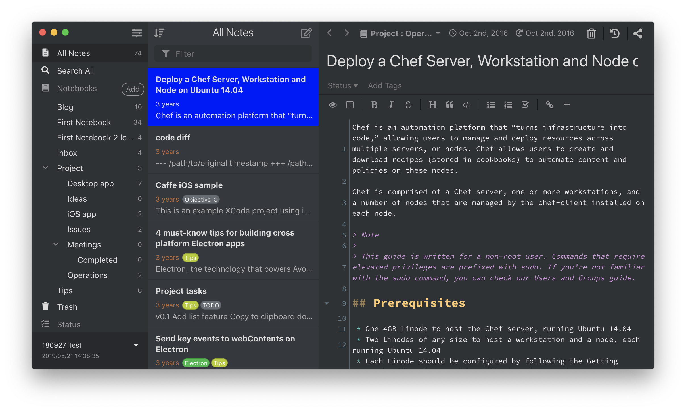

If you want to apply quick-and-dirty personal styling changes without creating an entire theme that you intend to publish, you can add styles to the `styles.less` file in [your data directory](/manual/basic-usage#user-data-directory).

For example, to change the color of selected item of the note list bar, you could add the following rule to your `styles.less` file:

```css
.note-list-bar-item .note-list-item-view.active {
  background-color: blue;
}
```



To inspect elements which you would like to tweak, enable **Development Mode** by selecting the _Inkdrop > Preferences_ menu, clicking the _General_ tab on the left hand navigation, and check the "_Development Mode_", then reload the app.
After that, you should get "Inspect Element" context menu by right-clicking any element on the app just like browser.

<div class="ui info message">

If you are unfamiliar with Less, it is a basic CSS preprocessor that makes some things in CSS a bit easier. You can learn more about it at [lesscss.org](http://www.lesscss.org/).

If you prefer to use CSS instead, you can do that in the same `styles.less` file, since CSS is also valid in Less.

</div>
