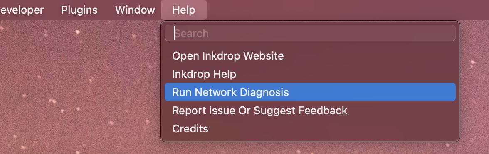
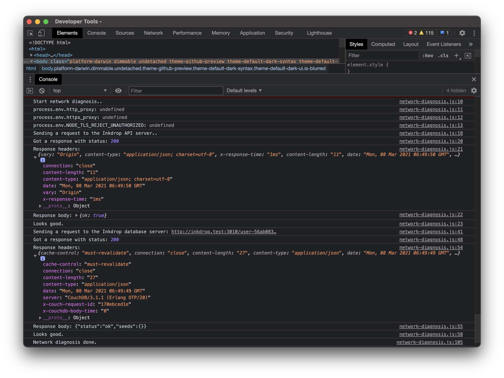

## I Can't Log In / Sync Not Working

### Use the latest version

Using an old version can cause a network issue.
For example, the version prior to v5.4.3 no longer works as expected due to [an Electron bug caused by the expiration of the Let's Encrypt root certificate](https://forum.inkdrop.app/t/lets-encrypt-root-certificate-expiration-error/2609).

You can download the latest version from [here](https://my.inkdrop.app/download).

### Restart Computer

As obvious as it sounds, it's always a good first step to make sure that you restart Inkdrop as well as your computer.
Restarting the computer flushes all kinds of system states and caches, while also resetting other programs and releasing locks on files and other resources.

### Configure Web Proxy

If you are working behind a company proxy or you have a local proxy running, it's necessary to tell Inkdrop to go through it.
Please read [this documentation](/manual/working-behind-a-corporate-web-proxy) to learn how to configure.

### Investigate Firewalls

If you are inside a corporate network, it may interrupt the request.
Please ask your network administrator to allow the app to access `*.inkdrop.app`.

### Investigate Gnome Keyring on Linux

Inkdrop stores your credentials in your Keyring.
If you are not on Gnome, such as KDE, you need to install `gnome-keyring`.

If you installed it via Snap and got an **AppArmor policy** error, please make sure you ran the below command to allow it to access to your keyring:

```sh
sudo snap connect inkdrop:password-manager-service
```

### Install Missing Packages on Linux

In some environment you need some additional packages installed. Please try installing following packages:

```
sudo apt-get install libgconf2-4 libcanberra-gtk-module libgnome-keyring0 gnome-keyring
```

### Run Network Diagnosis

You can run a network diagnosis from the menu _Help → Run Network Diagnosis_:



It launches Developer Tools and reports the diagnosis result in the console.
You should get something like this:



### Synchronize Notes from Scratch_

Inkdrop stores checkpointers for providing quick sync.
If your new edits are synced but old ones are missing, the checkpointers may be broken.
In this case, please try running sync from scratch by selecting menu _Help → Synchronize Notes from Scratch_.
By doing this, Inkdrop will try to sync data from the beginning of the change history.

## App won't launch

### "You can't open the application because this application is not supported on this Mac."

This error is due to [the Mac transition to Apple silicon](https://www.apple.com/newsroom/2020/06/apple-announces-mac-transition-to-apple-silicon/).
If the app doesn't launch on your Mac, you've downloaded an Apple silicon version of the app, which doesn't work on Intel-based Macs.
Also, if you've downloaded an Intel version of the app on an Apple silicon-based Mac (like M1 MacBook Air), the performance will be restricted due to the translation technology called Rosetta 2.

### Enable logging

To investigate what's happening, please try running the app from terminal with `--enable-logging` parameter.

#### On Windows

```
C:\Users\USER_NAME\AppData\Local\inkdrop\app-VERSION\Inkdrop.exe --enable-logging
```

#### On Linux

deb package:

```
/usr/bin/inkdrop --enable-logging
```

Snap app:

```
/snap/bin/inkdrop --enable-logging
```

#### On macOS

```
/Applications/Inkdrop.app/Contents/MacOS/Inkdrop --enable-logging
```

### Error: Failed to launch GPU process

If you get an error like below:

```
[4428:1217/161336.565:ERROR:browser_gpu_channel_host_factory.cc(154)] Failed to launch GPU process.
```

You can disable the GPU acceleration by appending `--disable-gpu-sandbox` parameter to avoid it.


## Plugin Won't Work

### Update the Plugin

Check if you are using the latest version of the plugin.
You can check currently installed plugins with `ipm ls`.
You can update them with `ipm update`.

### Restart the App

You have to reload the app so that it recognizes new plugins installed.

### Found an Issue on the Plugin

If it's an official plugin, please create a topic on [our forum here](https://forum.inkdrop.app/).
If a third-party plugin, please create an issue on its GitHub repository.

## Payment failed

### My credit card was declined with error code `do_not_honor` / `generic_decline`

That's probably because the charge was issued from Japan and your card issuer thought that's suspicious somehow.
But it is impossible from us to know the actual reason why your card has been declined.
Stripe provides [the documentation](https://stripe.com/docs/declines/codes) about these error codes but it is not helpful to solve it.

Therefore, **please ask your card issuer or bank to allow us to charge you from Japan**.
Some people with the same issue solved by doing that.
Sorry for the inconvenience.

For other error codes, please refer to [the Stripe documentation](https://stripe.com/docs/declines/codes).

### My debit card was declined

Please check your debit card supports recurring payments.
Some debit cards don't support paying for subscription services.
