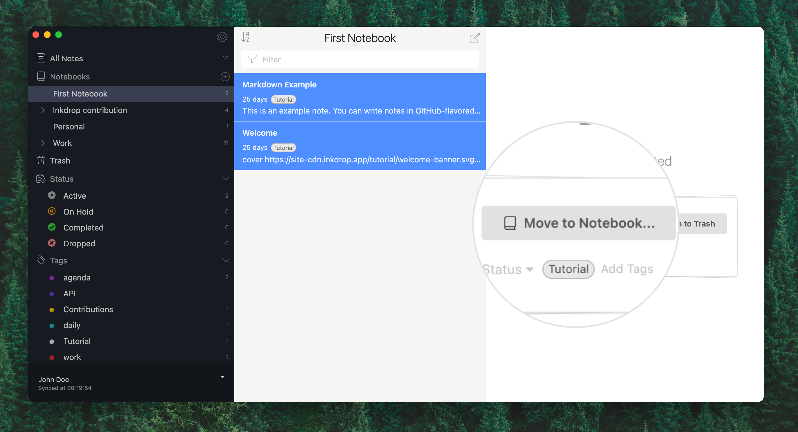
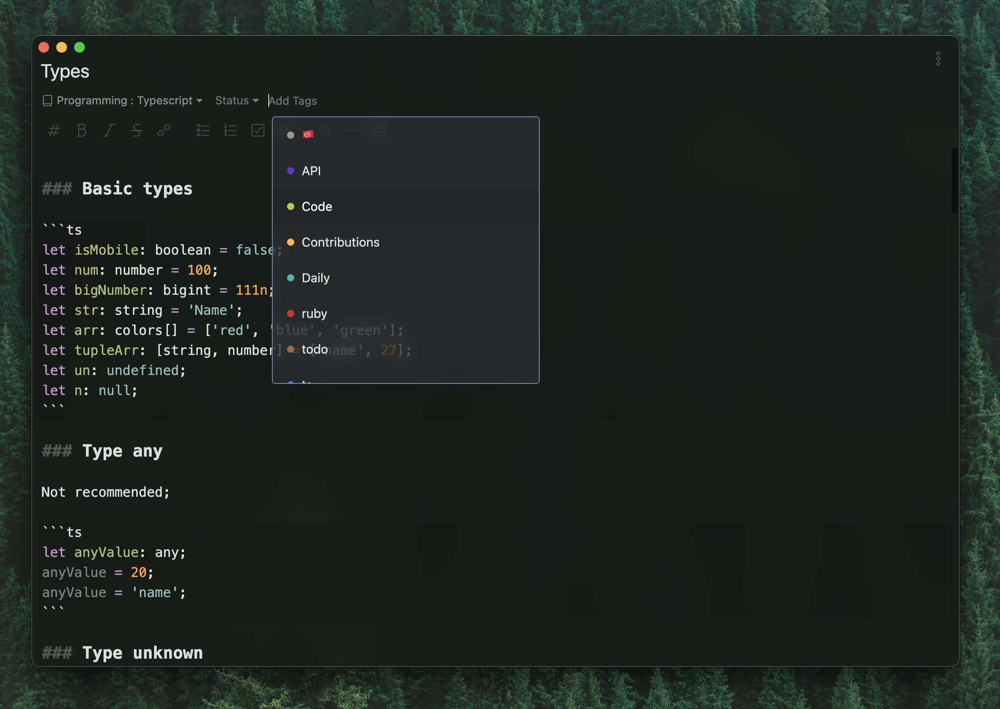

Notes are the central piece in the Inkdrop universe. You can perform all CRUD operations (create, read, update, and delete) with them, duplicate, and export notes in various formats.
Inkdrop supports both standard Markdown syntax and the
[GitHub Flavored Markdown (GFM)](/manual/markdown-cheatsheet) with inline formatting.

## Create notes

To create a note:

- Click  in the upper-right corner of the note list.  
  You can also use the <kbd>Command+N</kbd> / <kbd>Ctrl+N</kbd> shortcut.

An untitled empty note is created. Name the note, so it'll be easier to look for later.

## Delete notes

To delete a note, right-click the note and select the **Move to trash** option. Alternatively, you can select a note with a left-click and use the <kbd>Command+Del</kbd> / <kbd>Ctrl+Del</kbd> shortcut.

Inkdrop also lets you delete multiple notes at once. To do this:

1. Holding the <kbd>Command</kbd> / <kbd>Ctrl</kbd> key, select the notes you want to delete.  
   Inkdrop shows the number of selected notes in the rightmost area.
2. On the right screen, click ** Move to Trash**.

### Restore deleted notes

Inkdrop lets you restore the deleted notes.

To restore notes:

1. In the sidebar, click  **Trash**.
2. Select the notes you want to restore and click  **Move to Notebook** in the rightmost area.  
   
3. In the **Move to Notebook** dialog, select a notebook where you want to restore the notes.  
   The notes are restored to the selected notebook.

### Delete notes permanently

If you delete your notes permanently, there's no way to restore them.

To delete notes permanently:

1. In the sidebar, click  **Trash**.
2. Select the notes you want to delete permanently and click ** Delete Permanently** in the rightmost area.  
   The notes are deleted forever.

## Copy notes

Inkdrop lets you make a complete copy of notes. The copy has title, content, and tags of its original note.

To duplicate notes:

- Right-click the note to copy and select **Duplicate**.  
  Alternatively, select the note and use the <kbd>Command+D</kbd> shortcut.

The copy is created in the current notebook.

## Tag notes

Tags are keywords that you can add to notes, so they're easier to group and find. For example, you can add the `react` tag to all notes related to the technology. Tags help you organize and browse your notes a lot easier.

   You can use emojis to name tags. For example, if you learn a new language, you can tag the language-related notes with the corresponding country flag 🇮🇹

To tag a note:

1. Open the note you want to tag.
2. Under the note's title, enter the tag name in the **Add Tags** field.  
   Inkdrop suggests already existing tags as you enter.
3. Press <kbd>Enter</kbd> to add the tag to the note.

If it's a new tag, Inkdrop automatically adds it to the ** Tags** list. You can find the list in the sidebar.

## Live preview

Inkdrop lets you preview notes to see what they eventually look like.

To preview a note:

- Open a note and use <kbd>Command+P</kbd> / <kbd>Ctrl+P</kbd>.  
   The note and its preview are displayed side-by-side.  
  

There're 2 more ways to toggle preview. In the lower right corner of the editor:

- Click  to switch between the note and its preview.
- Click  to toggle note and its preview side-by-side.

Note that the icons are hidden by default. Hover the mouse cursor over the editor and icons will appear in the lower right corner of the editor.

## Distraction Free Mode

'Distraction Free Mode' lets you focus on the writing process by hiding the sidebar and note list.

To toggle the 'Distraction Free Mode':

- Use <kbd>Command+Shift+D</kbd> / <kbd>Ctrl+Shift+D</kbd>.

You can even hide the toolbar with controls for quick formatting. For this, take the following steps:

1. Open **Preferences** by clicking the  icon in the upper right corner of the sidebar.  
   You can also use <kbd>Command+,</kbd> / <kbd>Ctrl+,</kbd>.
2. Go to **Editing** and clear the **Toolbar** checkbox.  
   The toolbar is hidden.
