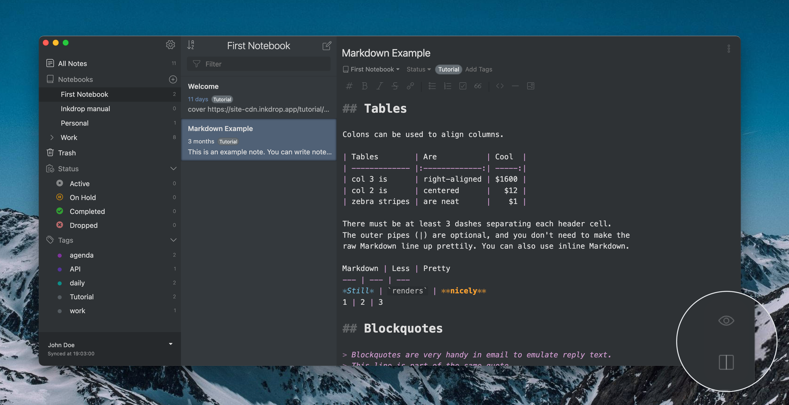
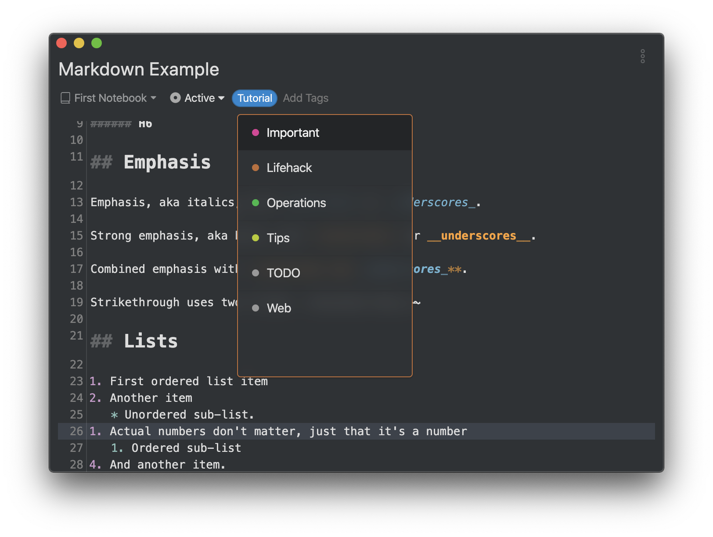

The editor supports both standard Markdown syntax and the
[GitHub Flavored Markdown (GFM)](/manual/markdown-cheatsheet) with inline formatting.

## Live preview

Inkdrop lets you preview notes to see how they will eventually look like. Use <kbd>Command+P</kbd> or <kbd>Ctrl+P</kbd> on Windows/Linux to display note and its preview side-by-side.

You can also toggle the preview mode by clicking the  icon in the lower right corner of the editor.
Or click  to toggle note and its preview side-by-side.

Note that the icons are hidden unless you hover the mouse cursor over the editor.

## Distraction Free Mode

'Distraction Free Mode' lets you focus on the writing process by hiding the sidebar and note list. To toggle the 'Distraction Free Mode', use <kbd>Command+Shift+D</kbd>, or <kbd>Ctrl+Shift+D</kbd> on Windows/Linux.

You can even hide the toolbar with controls for quick formatting. For this, take the following steps:

1. Open **Preferences** by clicking the  icon in the upper right corner of the sidebar.  
   You can also use <kbd>Command+,</kbd>, or <kbd>Ctrl+,</kbd> on Windows/Linux.
2. Go to **Editing** and clear the **Toolbar** checkbox.  
   It will hide the toolbar.

## Tag notes

Inkdrop lets you tag notes. It's another way to organize your notes.

Existing tags are listed on the sidebar.
