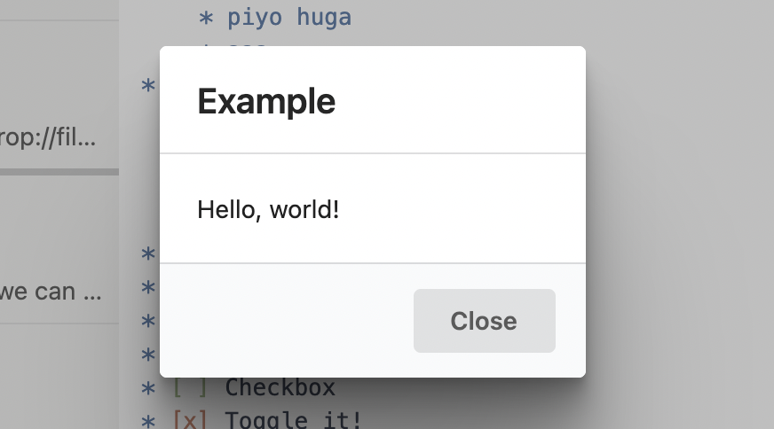

Available since v3.5.1.

A built-in React [component](/reference/component-manager) of Inkdrop that allows you to display a simple modal dialog with buttons.
To get the class of `Dialog` component:

```js
const Dialog = inkdrop.components.getComponentClass("Dialog")
```

## Props

```flow
type Props = {
  className?: string,
  children?: React.Node,
  visible: boolean,
  hiding: boolean,
  onBackdropClick?: () => any,
  autofocus?: boolean,
}
```

## Example

```js
"use babel"

import React, { useEffect, useCallback } from "react"
import { logger, useModal } from "inkdrop"

const HelloMessageDialog = props => {
  const modal = useModal()
  const { Dialog } = inkdrop.components.classes

  const toggle = useCallback(() => {
    modal.show()
    logger.debug("Dialog was toggled!")
  }, [])

  useEffect(() => {
    const sub = inkdrop.commands.add(document.body, {
      "yourplugin:toggle": toggle,
    })
    return () => sub.dispose()
  }, [toggle])

  return (
    <Dialog {...modal.state} onBackdropClick={modal.close}>
      <Dialog.Title>Example</Dialog.Title>
      <Dialog.Content>Hello, world!</Dialog.Content>
      <Dialog.Actions>
        <button className="ui button" onClick={modal.close}>
          Close
        </button>
      </Dialog.Actions>
    </Dialog>
  )
}

export default HelloMessageDialog
```

It produces:



## See also

- [The plugin tutorial](/manual/plugin-word-count#understanding-the-generated-code) that uses the `Dialog` component.
