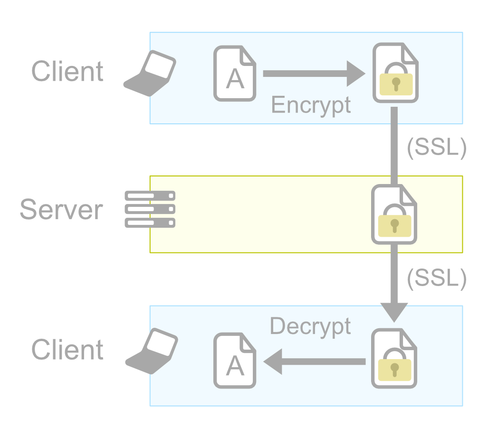

At Inkdrop, the security of your data is our highest priority.

## Transport Encryption

Inkdrop uses industry standard encryption to protect your data in transit. This is commonly referred to as transport layer security (“TLS”) or secure socket layer (“SSL”) technology.

## End-to-end Encryption

End-to-end encryption (E2EE) is a method of secure communication that prevents third-parties from accessing data while it's transferred from one end system or device to another.
Having data encrypted with this method will make it almost impossible for someone to tap your network, to access or steal our disk and get access to the original data.
All your notes, notebooks, tags and attachments are encrypted using AES-256 encryption on your own device when transporting them to the Inkdrop server.
A common key is generated when you sign up to Inkdrop.
This key, along with an initialization vector, is used to encrypt your data in GCM (Galois/Counter Mode).
The key is also encrypted while stored on disk, with a 256-bit AES key derived with PBKDF2 from your login password.

## Don't Forget Your Password

We never store a copy of this common key without encryption and don't use any escrow mechanism to recover your encrypted data. This means that if you forget your login password, we cannot recover your data and we can't even reset your password.
So we strongly recommend you to use a password manager to store your password of Inkdrop.
